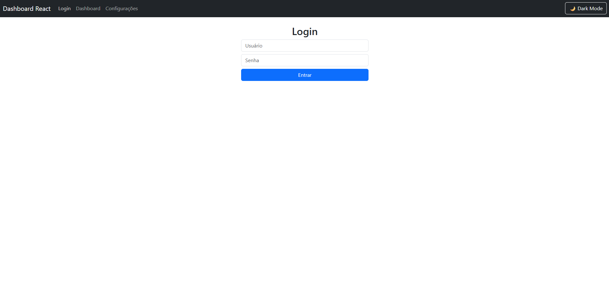

# 🌐 Dashboard Interativo em React.js

Um **Dashboard moderno e dinâmico** desenvolvido em **React.js**, que exibe informações em tempo real sobre **clima, criptomoedas, notícias e gráficos de mercado**.  
Projeto feito para consolidar meus estudos em **componentização, consumo de APIs e integração de bibliotecas**.

---

## 🚀 Funcionalidades

✅ **Login Simples** (simulação sem backend)  
🌦️ **Clima em Tempo Real** – dados da cidade escolhida  
💰 **Cotação de Criptomoedas** – Bitcoin, Ethereum e Binance Coin  
📈 **Gráfico do Bitcoin (7 dias)** – valores em Reais (R$)  
📰 **Últimas Notícias** – integração com a NewsAPI  
🌙 **Dark/Light Mode** – com persistência no navegador  
⚙️ **Página de Configurações** – escolha cidade do clima e preferências do usuário  

---

## 📷 Demonstração



---

## ⚙️ Como Rodar Localmente

```bash
# Clone este repositório
git clone https://github.com/SEU_USUARIO/dashboard-react.git

# Acesse a pasta do projeto
cd dashboard-react

# Instale as dependências
npm install

# Rode o projeto em modo desenvolvimento
npm start
